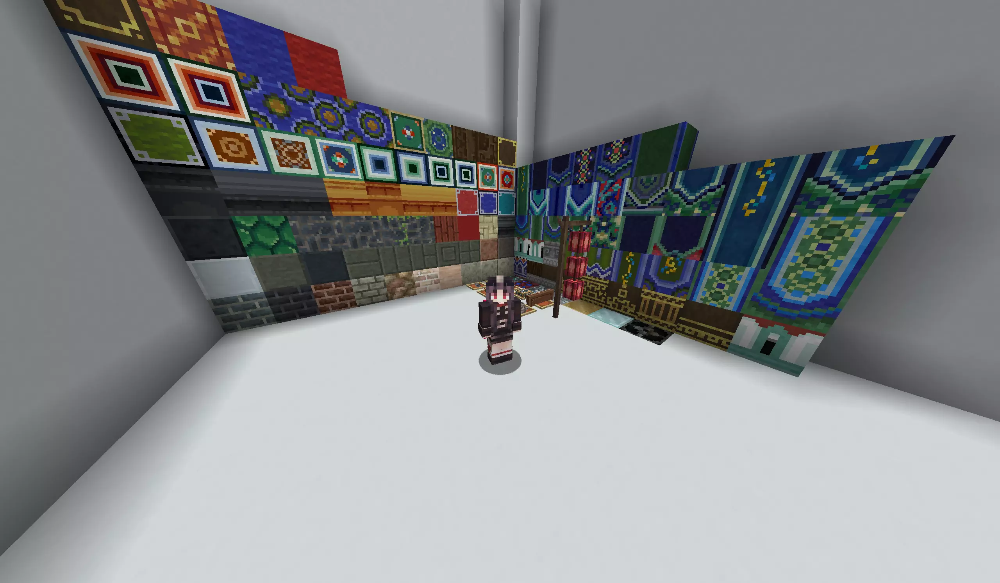

# 群青-CraftEngine| [English](README_EN.md)

> 将中式古建筑模组 [群青（Ultramarine）](https://github.com/LocusAzzurro/Ultramarine) 通过 [CraftEngine](https://github.com/Xiao-MoMi/craft-engine) 移植到 Paper 服务端。

## 项目简介

[群青（Ultramarine）](https://modrinth.com/mod/ultramarine) 是一款以中国古代木构建筑与室内陈设为灵感的外观模组，添加了数百种建筑方块、装饰构件、家具与生存材料。

本项目将其内容（方块、物品、家具、配方、矿物生成、掉落物、本地化与资源包）转换为 CraftEngine 配置，在 **Paper / Spigot / Folia** 服务端上运行：

- **纯服务端实现**：玩家无需安装任何模组，仅需加载服务器下发的资源包。
- **完整内容移植**：建筑方块、雕花构件、家具、瓷器、矿物与合成配方一应俱全。
- **原版风格贴图**：全部 16×16 贴图，与原生方块自然融合。

当前版本：`0.0.3`

> [!TIP]  
>
> 图片只展示部分物品



> [!WARNING]  
>
> ### 部分方块可能需要客户端模组！  
> 一些方块使用了原版方块状态，需要使用[客户端模组](https://modrinth.com/mod/craftengine-client-mod)以解决视觉问题

## 内容一览

| 分类 | 数量 | 说明 |
| --- | --- | --- |
| 建筑方块 | 60+ | 青砖、黑砖、棕红石砖、地砖、屋面瓦与屋脊等 |
| 装饰方块 | 300+ | 雕花木作、枋心、找头、勾头、椽、雀替、垂花、栏杆、脊兽等 |
| 家具 | 37 | 橱柜（可存储）、桌、椅（可坐）、床、屏风、门窗等 |
| 材料与物品 | 104 | 玉、白松石、赤铁、钴、瓷器、染粉、模板、食物等 |
| 合成配方 | 412 | 有序合成、切石、熔炼、高炉、烟熏、锻造升级 |
| 矿物生成 | 4 种 | 玉、白松石、赤铁矿（主世界）与钴矿（下界） |
| 生物掉落 | 2 种 | 羊/山羊/狐狸/兔子掉落兽皮；疣猪兽/掠夺者掉落生肉 |
| 资源包文件 | 733 | 模型与贴图 |
| 本地化 | 中/英 | `zh_cn` 与 `en_us` 共 800+ 条翻译 |

## 目录结构

```
Ultramarine/
├── pack.yml                  # 资源包元数据（作者、版本、命名空间）
├── configuration/            # CraftEngine 配置
│   ├── blocks/               # 方块（建筑、瓦片、雕花构件等）
│   ├── furniture/            # 家具（含存储与交互行为）
│   ├── material.yml          # 材料与物品
│   ├── recipes.yml           # 合成配方
│   ├── categories.yml        # 分类
│   ├── lang.yml              # 翻译
│   ├── image.yml             # 图片
│   ├── settings.yml          # 矿物生成与生物掉落
│   └── templates/            # 模板
└── resourcepack/             # 模型与贴图
    └── assets/minecraft/
        ├── models/
        └── textures/
```

## 安装方法

1. 在服务端安装 [CraftEngine](https://github.com/Xiao-MoMi/craft-engine)（阅读其[官方文档](https://xiao-momi.github.io/craft-engine-wiki/)了解版本要求）。
2. 将本仓库中的 `Ultramarine` 文件夹整体放入 `plugins/CraftEngine/resources/` 目录。
3. 执行 `/ce reload all` 命令重新加载 CraftEngine
4. 完成加载

## 鸣谢

- [群青 Ultramarine](https://github.com/LocusAzzurro/Ultramarine)：原作者 LocusAzzurro 及贡献者，贴图、模型与玩法设计均来自原模组。
- [CraftEngine](https://github.com/Xiao-MoMi/craft-engine)：XiaoMoMi 提供的服务端自定义内容引擎。

## 许可

- 原模组代码遵循 BSD-3-Clause，美术资源遵循 **CC BY-NC 4.0（署名 - 非商业性使用）**。
- 本项目仅为**非商业性**移植与学习交流用途，请勿用于任何商业用途；使用与转载时请保留原作者署名。
